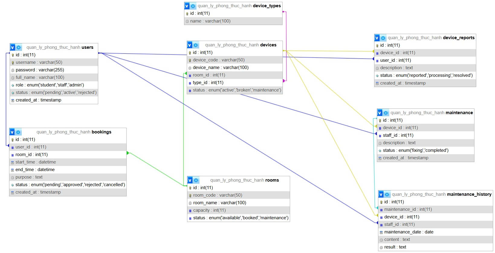

# HỆ THỐNG QUẢN LÝ PHÒNG THỰC HÀNH VÀ THIẾT BỊ

## 1. Tên đề tài
* **Hệ thống Quản lý Phòng thực hành và Thiết bị**

## 2. Danh sách thành viên và phân công
* **Nguyễn Việt Hùng (TV1):** Thiết kế Cơ sở dữ liệu, cấu hình kết nối chung (`config/database.php`) và module Quản lý Tài khoản (`pages/admin/quan_ly_user.php`)[cite: 3].
* **Vũ Minh Đức (TV2):** Phụ trách phân hệ Quản lý phòng thực hành (`pages/student/TV2-quanlyphongthuchanh.php`)[cite: 3].
* **Ôn Ngọc Phi (TV3):** Phụ trách phân hệ Quản lý booking (`pages/student/TV3-quanlybooking.php`)[cite: 3].
* **Đặng Đình Thái An (TV4):** Phụ trách phân hệ Quản lý thiết bị (`pages/staff/themthietbitv4.php`)[cite: 3].
* **Trương Văn Minh (TV5):** Phụ trách phân hệ Báo hỏng và bảo trì (`pages/staff/formbaotritv5.php`)[cite: 3].

## 3. Các đối tượng dữ liệu chính
* **Users (Người dùng):** Quản lý thông tin tài khoản và phân quyền (Admin, Cán bộ Lab, Sinh viên)[cite: 3].
* **Rooms (Phòng thực hành):** Quản lý danh sách và thông tin phòng lab[cite: 3].
* **Device_Types (Loại thiết bị):** Phân nhóm thiết bị[cite: 3].
* **Devices (Thiết bị):** Quản lý chi tiết từng thiết bị và trạng thái[cite: 3].
* **Bookings (Đặt phòng):** Lưu trữ lịch sử đăng ký phòng và mượn thiết bị[cite: 3].
* **Maintenances (Bảo trì):** Ghi nhận lịch sử xử lý thiết bị hỏng[cite: 3].

## 4. Các chức năng dự kiến
* Quản lý phòng thực hành, loại thiết bị và thiết bị chi tiết[cite: 3].
* Đặt lịch phòng theo khoảng thời gian và duyệt/từ chối yêu cầu[cite: 3].
* Báo hỏng thiết bị và cập nhật quy trình bảo trì[cite: 3].
* Tìm kiếm, lọc dữ liệu và kiểm tra phòng trống thông qua API JSON[cite: 3].
* Phân quyền truy cập hệ thống theo 3 cấp độ (Admin, Cán bộ Lab, Sinh viên)[cite: 3].

## 5. Các chức năng đã thực hiện đến hết Buổi 2
* **Kiến trúc hệ thống:** Xây dựng khung thư mục dự án chuẩn và file kết nối cơ sở dữ liệu chung (`config/database.php`)[cite: 3].
* **Cơ sở dữ liệu:** Hoàn thiện sơ đồ thiết kế và tạo file `database/database.sql`[cite: 3].
* **Tích hợp bài cá nhân:** Đã đưa các sản phẩm mã nguồn cá nhân của các thành viên vào đúng thư mục phân quyền[cite: 3]:
  * Module Quản lý User của TV1 (`pages/admin/quan_ly_user.php`)[cite: 3].
  * Module Quản lý phòng của TV2 (`pages/student/TV2-quanlyphongthuchanh.php`)[cite: 3].
  * Module Quản lý booking của TV3 (`pages/student/TV3-quanlybooking.php`)[cite: 3].
  * Module Quản lý thiết bị của TV4 (`pages/staff/themthietbitv4.php`)[cite: 3].
  * Module Báo hỏng của TV5 (`pages/staff/formbaotritv5.php`)[cite: 3].

## 6. Sơ đồ ERD Cơ sở dữ liệu

## 7. Hướng dẫn chạy Script / Cài đặt
1. **Khởi tạo Cơ sở dữ liệu:**
   - Import file `database/schema.sql` trước để tạo cấu trúc toàn bộ các bảng và khóa ngoại.
   - Import tiếp file `database/seed.sql` để nạp dữ liệu mẫu ban đầu (dữ liệu tiếng Việt).
2. **Cấu hình kết nối:**
   - Kiểm tra thông tin kết nối trong file cấu hình (`config/database.php`) trỏ tới cơ sở dữ liệu `quan_ly_phong_thuc_hanh` với tài khoản `root` mặc định của XAMPP.
3. **Chạy ứng dụng:**
   - Đặt thư mục dự án vào thư mục gốc của server cục bộ (`htdocs` đối với XAMPP) và chạy đường dẫn trên trình duyệt web.